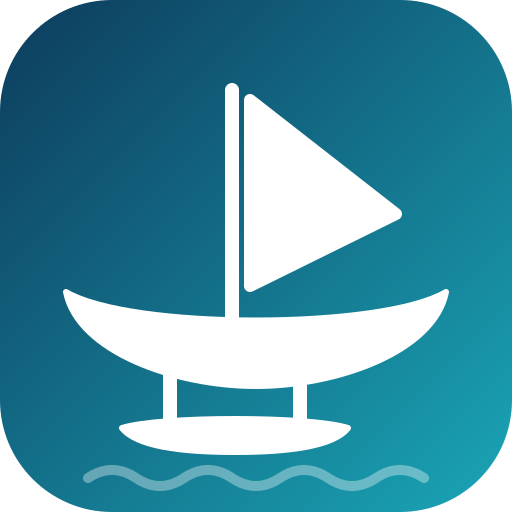

<p align="center"></p>

# Outriggarr

Fills Sonarr and Radarr wanted lists from YouTube (or any yt-dlp site) and hands the files back through their own manual-import APIs. Sonarr and Radarr stay in charge of what is wanted, quality, naming, folders and notifications; Outriggarr rides alongside and never writes into a library folder.

An outrigger is the float rigged beside a hull to keep it steady.

## How it works

1. **Subscriptions** attach a video source (channel or playlist) to a Sonarr series. On a schedule the scheduler reads the series' missing, monitored, aired episodes from Sonarr, lists the newest videos from the source (50 by default; a subscription can list deeper, up to 5000, when its episodes sit behind hundreds of newer uploads; playlists are always listed whole), and matches them: overrides first, then an optional title regex, then normalised titles, then upload dates. Each match becomes a job. Unmatched episodes are shown in the GUI with what each strategy saw, so you can pin a video to an episode with one click.
2. **Grab** queues jobs by hand: paste a video or playlist URL, pick the series and episodes (or a Radarr movie per row), queue.
3. **Jobs** download with yt-dlp into a staging folder both containers can see, rename to a parseable name, then call the *arr's ManualImport with explicit episode or movie ids in *move* mode. The *arr moves and renames the file into the library and fires its own notifications. The staging folder is removed. Failures keep the *arr's own error text on the job; download errors retry with backoff, import rejections wait for you.

Everything is a job: a subscription scan and a manual grab produce the same row and one runner processes them.

## Requirements

- Sonarr v4 and/or Radarr (v3 API). One instance each.
- A staging directory that Sonarr/Radarr can see. Simplest: mount your data share into Outriggarr exactly as you do for Sonarr/Radarr (e.g. `/data`) and set `OUTRIGGARR_STAGING_DIR=/data/outriggarr`; the *arr then moves files within one filesystem (an atomic rename). Alternatively mount only the staging folder as `/staging` (the default) — less access for Outriggarr, same result as long as the *arr sees the same host folder. Either way, each connection's *staging path* setting is the path as that *arr sees it.
- The series you want must exist in Sonarr with their episodes (TVDB carries many YouTube-native shows).

## Run

```yaml
services:
  outriggarr:
    image: healzangels/outriggarr:latest   # built and pushed by GitHub Actions on every push to main
    container_name: outriggarr
    environment:
      PUID: "1000"                   # match your Sonarr/Radarr user so they can move staged files
      PGID: "1000"
      UMASK: "002"
      TZ: "Etc/UTC"
      OUTRIGGARR_YTDLP_UPDATE: "0"   # "1" upgrades yt-dlp on every start
      OUTRIGGARR_STAGING_DIR: /data/outriggarr
    stop_grace_period: 60s            # lets an in-flight download abort cleanly (Docker's default 10 s kills it)
    volumes:
      - ./config:/config             # SQLite DB, cookies file, deno cache
      - /path/to/data:/data          # the same data share Sonarr/Radarr mount
    ports:
      - "8080:8080"
    networks: [arr]                  # the network your *arr containers are on
```

Images: every push to `main` runs the tests and pushes `latest` (plus a `sha-…` tag) to Docker Hub; a `vX.Y.Z` git tag also pushes `X.Y.Z` and `X.Y`. Local build: `docker build -t outriggarr .` (needs internet: it fetches ffmpeg, deno and Python packages).

Unraid: `unraid/my-outriggarr.xml` is a ready template (copy it to `/boot/config/plugins/dockerMan/templates-user/`). It maps your data share to `/data` like the *arr templates do, stages under `/data/outriggarr`, and expects `PUID`/`PGID`/`UMASK` matching your Sonarr/Radarr template, a config path under appdata, the same custom network as the *arr containers, and a host port for 8080. YouTube's JavaScript challenges are solved by deno plus the bundled `yt-dlp-ejs` package, and `curl_cffi` provides browser impersonation for the requests that need it; nothing is downloaded at runtime for either.

Then open the GUI → **Settings** → add Sonarr (and Radarr): URL, API key, and the staging path *as that app sees it*. **Test** checks the API key, that the server really is the kind you said, and that it can see the staging directory.

No built-in authentication: put it behind your reverse proxy / SSO like the other *arr companions. The *arr API keys live in the SQLite file under `/config`.

## Screens

| Screen | What it does |
|---|---|
| Activity | Every job with status, progress, attempts, verbatim error text; Retry and Cancel. Refreshes every 3 s. |
| Series | Search Sonarr's series, subscribe with a source URL and matching options; per subscription: match preview (dry run), unmatched episodes with an override picker, *Scan now*, recent jobs. |
| Grab | Paste a URL/playlist → pick targets per row (bulk-fill for playlists, newest-first toggle) → queue. |
| Settings | Connections and download options: scan interval, concurrency, videos per scan, default yt-dlp format, container, cookies file, extra yt-dlp options (JSON, merged last), audio language tag, optional Sonarr tag. |

## Matching

Strategies run in a fixed order and the first one that yields exactly one candidate wins; zero or several fall through. A pairing that is not a pin or an exact title is then checked against the episode's runtime: a video shorter than half or longer than twice it (and off by more than five minutes) is *held* with the reason instead of queued, and the *Matches* page lists every pairing riskiest first so a wrong one is a glance away:

1. **Override** — a video pinned to an episode from the GUI. Always on.
2. **Regex** — `title_regex` with named groups `episode` (required) and `season` (optional).
3. **Title** — both sides lower-cased, punctuation stripped, whitespace collapsed, `Ep. 5` / `#5` / `Episode 5` prefixes removed; equality first, then containment (episode title of at least 6 characters).
4. **Date** — upload date within *tolerance* days of the air date plus *offset*. Upload dates need a per-video fetch, so this only runs for still-unmatched episodes.

## JSON API

Everything the GUI does is a JSON endpoint under `/api` (FastAPI docs at `/docs`): connections (+test), subscriptions (+preview, scan, overrides), jobs (+retry, cancel), resolve, live series/episode/movie lookups, settings. No API key: the reverse proxy is the boundary.

## Notifications

Settings → Notifications takes [Apprise](https://github.com/caronc/apprise) URLs, one per line (Discord, Telegram, Pushover, ntfy, Gotify, email, …). Outriggarr announces its own events only: a job that failed for good, a subscription scan error (once per new error), and optionally a completed import. *Send test* confirms delivery.

## Subtitles

When the upload carries captions in a language listed in the *Subtitle languages* setting (default `en`), they are downloaded and converted to `.srt` sidecars named after the video, e.g. `Show - S01E02 - Title [WEBDL-1080p].en.srt`. Sonarr/Radarr import them with the episode when *Settings → Media Management → Import Extra Files* is on and includes `srt` (the connection Test warns if not). Auto-generated captions are skipped unless *Auto-generated captions too* is enabled.

## Audio language

YouTube audio tracks carry no language tag, so players such as Plex show the audio as *Unknown*. After the merge, Outriggarr remuxes the file once (stream copy, no re-encode) stamping the `audio_language` setting (default `eng`) on every audio stream. Blank the setting for mixed-language sources.

## Quality and naming

Staged as `{Series} - SxxEyy - {Title} [WEBDL-{res}p].{ext}` / `{Movie} ({Year}) [WEBDL-{res}p].{ext}`. Quality from the downloaded height: ≥2160 → WEBDL-2160p, ≥1080 → WEBDL-1080p, ≥720 → WEBDL-720p, else WEBDL-480p. The default yt-dlp format caps at 1080p and prefers H.264/AAC; change it in Settings (or per subscription) for 4K profiles.

## Development

```
uv sync
uv run pytest
uv run ruff check . && uv run ruff format .
uv run uvicorn outriggarr.main:app --reload
```

Tests use fakes for Sonarr/Radarr and yt-dlp; nothing touches the network. `DESIGN.md` is the source of truth for scope and architecture; `CLAUDE.md` holds the working rules.

## Licence

MIT — see `LICENSE`.
